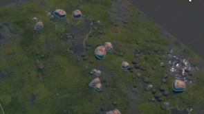
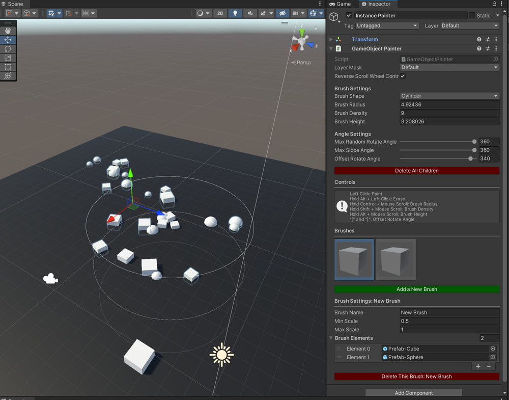

# GameObject Painter
An Editor tool for painting pre-defined GameObject sets in the world.

Here is the [devlog](https://github.com/huchi57/Memo/blob/main/Ideas/The%20Maths%20Behind%20Placing%20Many%20Objects%20(And%20Removing%20Them).md) behind the main math implementations of this tool.

|  |
| --- |
| This GIF demonstration uses Unity's 3D Game Kit demo assets. |

# Features
- Paint GameObjects in the Editor by adjusting brush settings.
- Preview brush elements that will be placed.
- Create different sets of brushes.
- Brush elements will automatically find suitable surfaces to be placed on.

# Installation And Quick Start
There are several ways to install this package into your Unity project:

- Unity Package Manager
  - In the Unity Editor, go to `Window` > `Package Manager`.
  - In the Package Manager window, click on the top left plus (+) icon, and then click `Add package from git URL...`.
  - Paste the following link: `https://github.com/huchi57/GameObjectPainter.git`, and then click on `Add`.
- Plain Install
  - Clone / download this repository and put it under your project's Asset folder.

After installation, you should be able to use add a **GameObject Painter** by one of the two methods:
- `Components` > `OwO` > `GameObject Painter`.
- `GameObject` > `OwO` > `GameObject Painter`.

A demo scene can be located at the directory `Sample/GameObjectPainter_DemoScene.unity`.

# Manual
Here is what the **GameObject Painter** looks like in the Editor. The following section contains a brief introduction to each field's usages, and how to use this tool.

|  |
| --- |

## Inspector Fields
### Main Options
| Field | Description |
| --- | --- |
| Layer Mask | The detection layers that a GameObject can be painted on. |
| Reverse Scroll Wheel Control | When enabled, scroll whell controls will be inverted. |
| Brush Shape | The shape of the brush, including Sphere, Cylinder, and Box.
| Brush Radius | The radius of the GameObject brush. The higher the value, the more area the objects will cover. |
| Brush Density | How dense should the GameObjects be painted. |
| Brush Height | How high the brush volume is. |
| Max Random Rotate Angle | The max angle that a GameObject element will rotate along its local center. |
| Max Slope Angle | The max angle of the slope that allows a GameObject to be painted. |
| Offset Rotate Angle | The global rotation of all GameObjects to be painted. |

### Brush Settings
The following settings are different per brush.
| Field | Description |
| --- | --- |
| Brush Name | The display name of the brush. |
| Min Scale | The min scale of an individual GameObject element. |
| Max Scale | The max scale of an individual GameObject element. |

## Usage
1. When a **GameObject Painter** is added to a Scene, a default empty "New Brush" is created automatically.
2. Go to the brush's `Brush Elements` list and add Prefabs that you wish to be painted, and set up the brush's `Min Scale` and `Max Scale`.
3. Move the cursor to the Scene View. If set up correctly, you should see GameObject previews enclosed in outlines indicating the size and the area of the brush.
4. Left click to paint these objects.

## Scene View Controls
- **Left Click:** Paint.
- **Hold Alt + Left Click:** Erase (the outline should changed into red when you hold the alt key.
- **Hold Control + Mouse Scroll:** Change the `Brush Radius`.
- **Hold Shift + Mouse Scroll:** Change the `Brush Density`.
- **Hold Alt + Mouse Scroll:** Change the `Brush Height`.
- **\[ and \] keys:** Change the `Offset Rotate Angle`.

# References
- [3D Game Kit](https://assetstore.unity.com/packages/templates/tutorials/3d-game-kit-115747) (link to the Asset Store) - by Unity Technologies.
